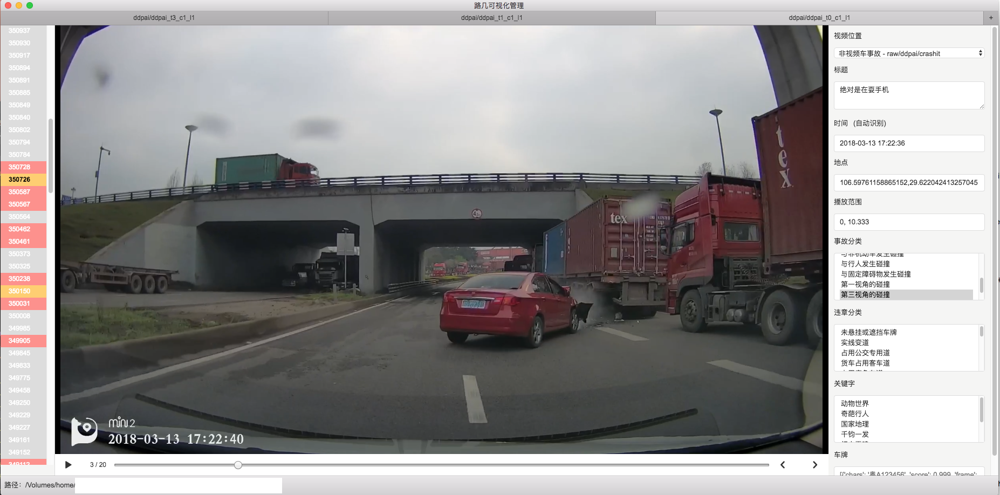

# ruki-tool
[路几](https://www.ruki.pw)可视化管理工具，基于[electron-react-boilerplate](https://github.com/chentsulin/electron-react-boilerplate)开发，用于将[路几爬虫](https://github.com/zomco/ruki-spider)爬下来的行车记录仪视频进行人工分类

## 效果图

